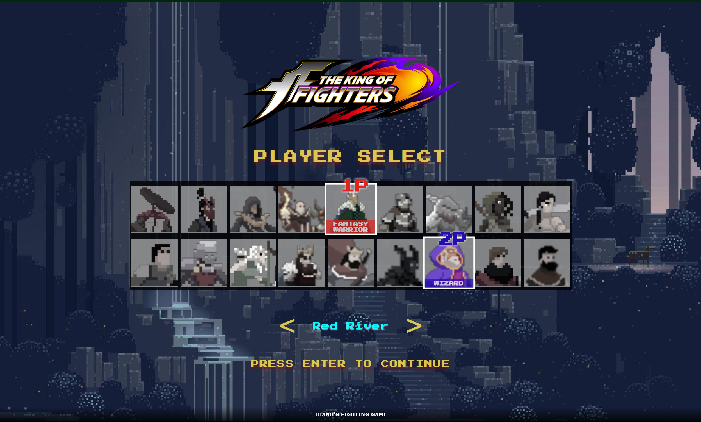
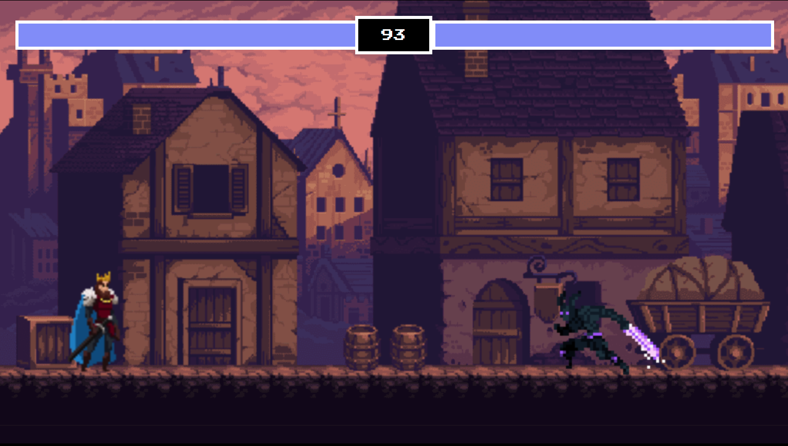

# 2d-fighting-game

  </img>
  </img> 

<h1>How to play?</h1>
<ul>
  <li>Live demo: <a href="https://xthanh-2d-fighting-game.netlify.app"> 2D-fighting-game </a></li>
  <li>First player buttons: Choose your character using your mouse and submit your choice by pressing 'Space'
  <ul>
    <li> A: go left </li>
    <li> D: go right </li>
    <li> W: jump </li>
    <li> Space: attack </li>
  </ul></li>
  <li>Second player buttons: Choose your character using your mouse and submit your choice by pressing '0'
  <ul>
    <li> ArrowLeft: go left </li>
    <li> ArrowRight: go right </li>
    <li> ArrowUp: jump </li>
    <li> 0 (zero): attack </li>
  </ul></li>
</ul>
<h1>Credits</h1>
<ul>
  <li> Tutorial: <a href="https://www.youtube.com/watch?v=vyqbNFMDRGQ&t=4s"> Chris Courses's Video </a></li>
  <li> <a href="https://luizmelo.itch.io"> Characters set by Luiz Melo </a>  </li>
</ul>
